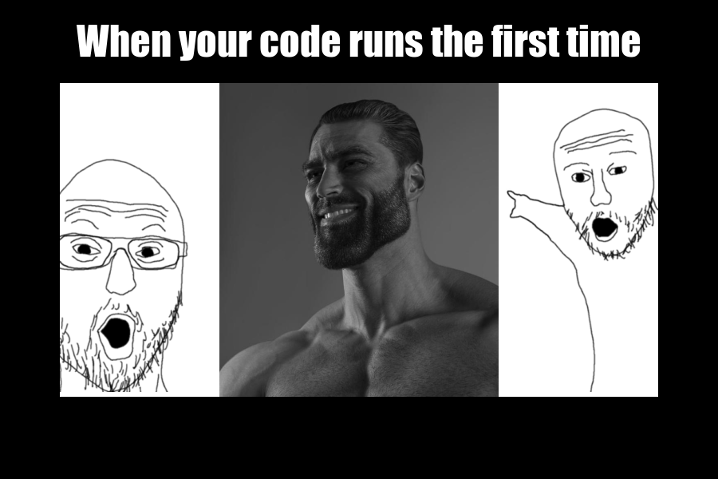

## Meme


### Meme Information
#### Inspiration
Since we are learning about coding in R, I decided to create this meme. It captures one of the purest feelings of success - running code without fail. In a field where syntax and logical errors can so easily stop you in your tracks, it is both refreshing and encouraging to get it right the first time.

To be original, I have combined two relatively well known existing meme formats: "Gigachad" and "Two soyjaks pointing". "Gigachad" is primarily used to portray something in a positive light by using a picutre of a conventionally attractive man. E.g. "Average ". "Two soyjaks pointing" creates the effect of something being impressive. Together, they portray the impressiveness of having your code run on your first try.

#### 


### Meme Creation Code
```markdown
library(magick)
soyjaks <- image_scale(image_trim(image_read('https://i.kym-cdn.com/photos/images/newsfeed/001/926/250/bd1.png')),"500x500")
soyjak1 <- image_crop(soyjaks, "200x")
soyjak2 <- image_crop(soyjaks, "200x + 275")

gigachad <- image_scale(image_read('https://melmagazine.com/wp-content/uploads/2021/01/66f-1.jpg'), "350x500")
combined <- image_append(c(soyjak1, gigachad, soyjak2))

background <- image_blank(width = 900,
                          height =600,
                          color = "#000000")

meme <- image_composite(background, combined, gravity = "center" )%>% 
  image_annotate(text = "When your code runs the first time",
                 color = "#FFFFFF",
                 size = 50,
                 font = "Impact",
                 gravity = "north",
                 location = "+0+20")
image_write(meme, "my_meme.png")
```
